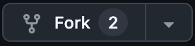
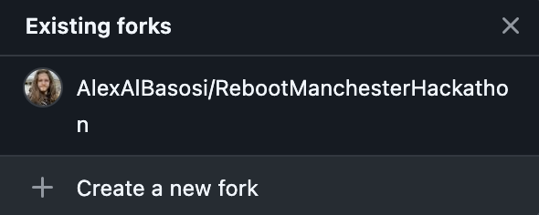
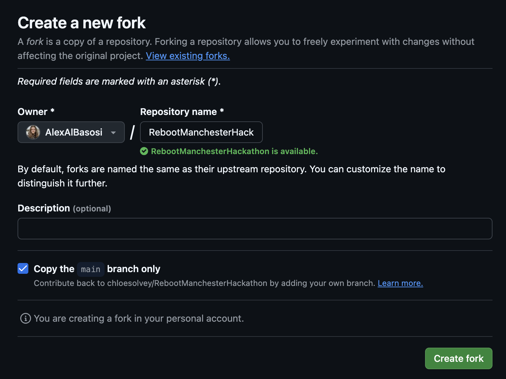
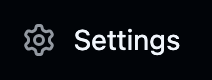
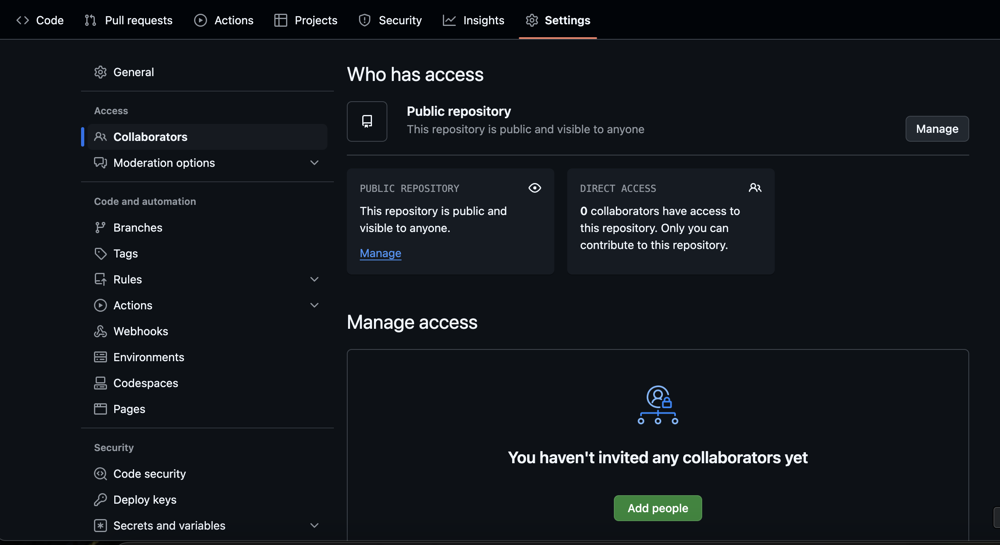
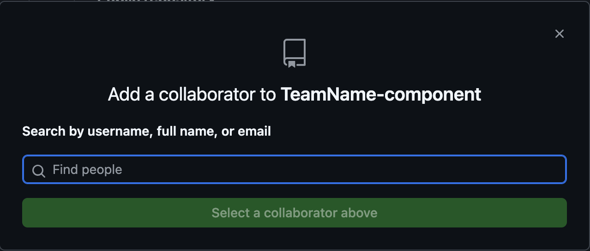
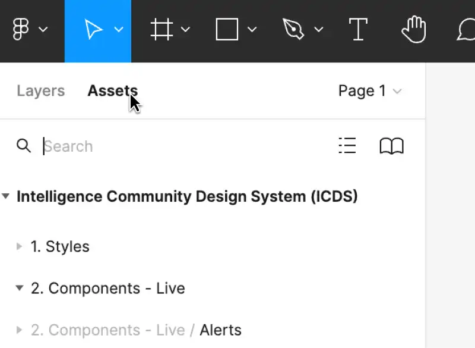
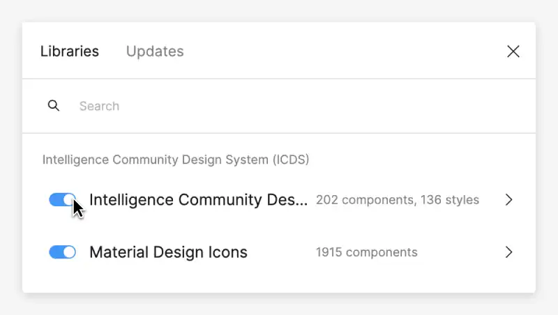

<<<<<<< HEAD
# Getting Started with Create React App

This project was bootstrapped with [Create React App](https://github.com/facebook/create-react-app).

## Available Scripts

In the project directory, you can run:

### `npm start`

Runs the app in the development mode.\
Open [http://localhost:3000](http://localhost:3000) to view it in your browser.

The page will reload when you make changes.\
You may also see any lint errors in the console.

### `npm test`

Launches the test runner in the interactive watch mode.\
See the section about [running tests](https://facebook.github.io/create-react-app/docs/running-tests) for more information.

### `npm run build`

Builds the app for production to the `build` folder.\
It correctly bundles React in production mode and optimizes the build for the best performance.

The build is minified and the filenames include the hashes.\
Your app is ready to be deployed!

See the section about [deployment](https://facebook.github.io/create-react-app/docs/deployment) for more information.

### `npm run eject`

**Note: this is a one-way operation. Once you `eject`, you can't go back!**

If you aren't satisfied with the build tool and configuration choices, you can `eject` at any time. This command will remove the single build dependency from your project.

Instead, it will copy all the configuration files and the transitive dependencies (webpack, Babel, ESLint, etc) right into your project so you have full control over them. All of the commands except `eject` will still work, but they will point to the copied scripts so you can tweak them. At this point you're on your own.

You don't have to ever use `eject`. The curated feature set is suitable for small and middle deployments, and you shouldn't feel obligated to use this feature. However we understand that this tool wouldn't be useful if you couldn't customize it when you are ready for it.

## Learn More

You can learn more in the [Create React App documentation](https://facebook.github.io/create-react-app/docs/getting-started).

To learn React, check out the [React documentation](https://reactjs.org/).

### Code Splitting

This section has moved here: [https://facebook.github.io/create-react-app/docs/code-splitting](https://facebook.github.io/create-react-app/docs/code-splitting)

### Analyzing the Bundle Size

This section has moved here: [https://facebook.github.io/create-react-app/docs/analyzing-the-bundle-size](https://facebook.github.io/create-react-app/docs/analyzing-the-bundle-size)

### Making a Progressive Web App

This section has moved here: [https://facebook.github.io/create-react-app/docs/making-a-progressive-web-app](https://facebook.github.io/create-react-app/docs/making-a-progressive-web-app)

### Advanced Configuration

This section has moved here: [https://facebook.github.io/create-react-app/docs/advanced-configuration](https://facebook.github.io/create-react-app/docs/advanced-configuration)

### Deployment

This section has moved here: [https://facebook.github.io/create-react-app/docs/deployment](https://facebook.github.io/create-react-app/docs/deployment)

### `npm run build` fails to minify

This section has moved here: [https://facebook.github.io/create-react-app/docs/troubleshooting#npm-run-build-fails-to-minify](https://facebook.github.io/create-react-app/docs/troubleshooting#npm-run-build-fails-to-minify)
=======
# Reboot Manchester Hackathon

This is the repository for the Reboot Hackathon being held in Manchester.

## Fork this Repository

To track each team's code repositories, any team member who's responsible for building a component must fork this repository so that it can be incorporated into the judging criteria when selecting the winners.

To fork this repository, select the `Fork` dropdown menu next to the title:



Then select `+ Create New Fork`:



For the `Repository name`, please make sure you enter your team's name so that we can keep track of the different repositories.

If your team is building multiple components and requires multiple repositories, fork this repository and enter the team name followed by the name of the component.

For example, if you have a `frontend` and `backend` application, the first fork can be called `TeamName-frontend` and the second fork can be called `TeamName-backend`.

> [!NOTE]
> If you're only building a single component, you can leave the `Repository name` as `TeamName`.

Once you've entered the name, select `Create fork`:



### Add Collaborators

Now that you've created your own fork, if another member within your team wants to contribute to the code, you would need to add them as a collaborator.

To do so, navigate to the repository containing your fork and click on `Settings`:



Then select the `Collaborators` option in the navigation menu on the left:



Select `Add people`:



And search for the `username`, `full name`, or `email` of the member you want to add to the repository.

Then they can clone your repository and contribute code to your fork.

> [!NOTE]
> Please make sure to add them to your forked version of the repository. You won't be able to add them here directly.

Now you're ready to start. Happy coding!

## The UK Intelligence Community's Design System

> [!NOTE]
> To help speed up the design and development process during the hackathon, we have included some resources here that are actively used by government agencies in the UK to design and build web applications.

This Design System helps you to design and build complex, specialised apps and services. It's used by MI6, MI5, GCHQ and our partners to construct tools that keep the UK safe and prosperous.

The Design System empowers through accessibility-by-design, a diverse and inclusive community, and flexible tech and implementation options.

You can read more about it on their [website](https://design.sis.gov.uk/).

### Install the UI Kit Components

Install and use the UI Kit component library. Use React or web components to quickly build accessible interfaces.

#### Installing the components

The UI Kit components are available on [npmjs.com](https://www.npmjs.com/), and can be installed from the command line:

```
// Web components, Angular, Vue, Svelte
npm install @ukic/web-components @ukic/fonts

// React
npm install @ukic/react @ukic/fonts
```

#### Using the components

To use the components in a particular framework, follow the framework instructions.

- [React](https://design.sis.gov.uk/get-started/install-components/react)
- [Angular](https://design.sis.gov.uk/get-started/install-components/angular)
- [Vue](https://design.sis.gov.uk/get-started/install-components/vue)
- [Svelte](https://design.sis.gov.uk/get-started/install-components/svelte)
- [Gatsby](https://design.sis.gov.uk/get-started/install-components/gatsby)
- [Next.js](https://design.sis.gov.uk/get-started/install-components/nextJS)

Web components can be used without the need for a framework. To use web components without a framework, follow the [web components instructions](https://design.sis.gov.uk/get-started/install-components/web-components).

Custom Elements Everywhere has [more information on how web components work with other frameworks](https://custom-elements-everywhere.com/).

#### Using third-party components

If you can't find a suitable component in this Design System, then you can use one from a third-party library. Use the library's theming and customisation options and follow our [styles](https://design.sis.gov.uk/styles) so that they look and feel as similar as possible.

You can replace the third-party components once they are released in the Design System.

### Figma UI Kit

Reusable and flexible Figma components used to design, prototype and hand-off designs for apps and digital products.

#### About the Figma UI Kit

We've built a Figma UI Kit to use alongside the guidance and code you'll find on this website. It'll make it easier to prototype and build things quickly.

All Figma resources have been built with our users in mind, with a strong focus on making sure accessibility is embedded from the start. That way we can provide an amazing experience that is usable for everyone.

#### Accessing the library for internal users

The UI Kit is turned on by default for all projects within our community. Check that you are using the latest version.

1. In a new or existing Figma design file, click 'Assets' from the left-hand side panel then click the 'Team library' icon (the book).



2. Make sure the Intelligence Community Design System library is turned on.



#### Not part of the Intelligence Community?

We've published our [Figma UI Kit](https://www.figma.com/community/file/1392159713403656562) to the Figma Community so that everyone can use our resources.

You can make a copy of it in your local files and use the components in your designs. This is a static version and you won't automatically receive component updates. Check Figma Community regularly for new updates and versions.

1. Navigate to the [Intelligence Community UI Kit on Figma Community](https://www.figma.com/community/file/1392159713403656562).
2. Duplicate the library into your drafts and connect your project files.
3. Use the [swap libraries](https://help.figma.com/hc/en-us/articles/360039150413-Swap-components-and-instances) function in Figma to quickly swap your components from one version to the next.

If you want to request a new feature, or if you notice any issues, you can [raise it on GitHub issues](https://github.com/mi6/ic-design-system/issues). For more information please read h[ow to contribute to the Figma UI Kit](https://design.sis.gov.uk/community/contribute#contribute-to-the-figma-ui-kit).
>>>>>>> 4b0babb9d06ecfe4af8d18d811fa366453c6b14e
